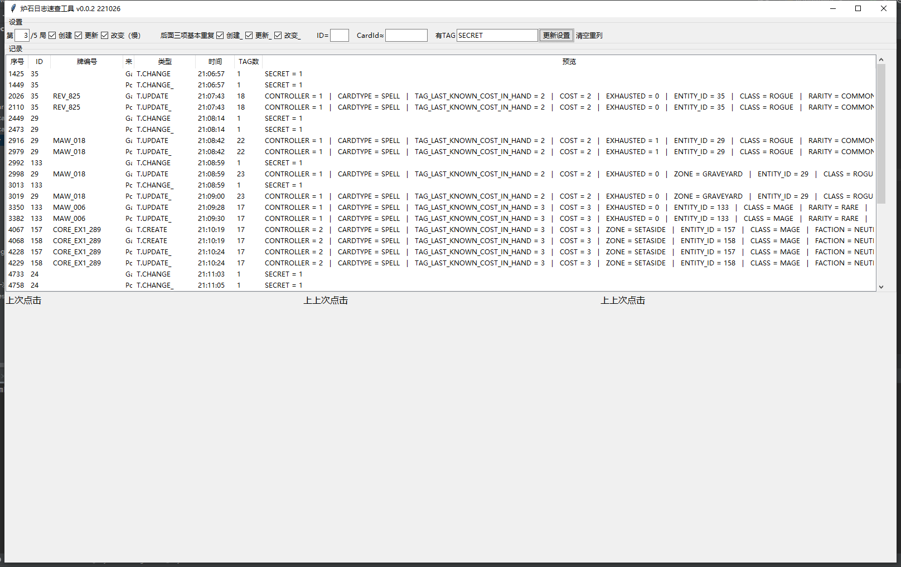

Hearthstone Log Viewer
# 功能介绍
* 点击左上按钮开始，加载炉石日志文件夹或当前文件夹的Power.log，列出所有实体记录，显示最近点击的3条详情。
* 可筛选某一对局、某来源、某实体ID、卡牌编号或有某标签的实体，点中间按钮刷新。
* 右键调整字体大小。
# 已知问题
* 加载到Treeview的性能差，勾选TAG_CHANGE特别慢。
* Treeview高度写死。
# 更新说明
* v0.0.1 基本实现。
* v0.0.2 拆分GameState和PowerTaskList，可筛选ID/CardID/TAG。

